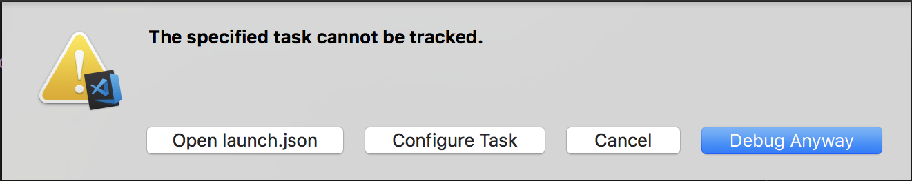

# Remote Debugging Raspberry PI's C/C++ Applications with VSCode

Demostrates using VSCode to remote launch and debug application on Raspberry Pi.

In this demo, it assumes the source code is only avaiable and get compiled on host side,
and you don't need to sync the source code to Raspberry Pi.  

BTW, f the source code is on the target (Raspberry Pi), you can 1) use remote desktop,
like RDP or VNC to build and debug application, or 2) refer to [The Useful RaspberryPi Cross Compile Guide](https://medium.com/@au42/the-useful-raspberrypi-cross-compile-guide-ea56054de187) to
utilize the shared folder, etc.

## Debugging Basic

For performing source level debugging, except the executable itself, it should also
provide the debugger the symbols and debugging information.  Usually, it can have the
compiler to generate the debug symbols with '-g' compiler option.

GDB and gdbserver communicate via either a serial line or a TCP connection, using the
standard GDB remote serial protocol.

The gdbserver is much smaller than GDB and easiler to port to a new platform.

On the target machine, you need to have a copy of the program you want to debug.
gdbserver does not need your program's symbol table, so you can strip the program
if necessary to save space.

All of the VSCode configuration is this demo assume the source code is available only in host
side.   The communication of debugging protocol between host and target is through
SSH tunnel.

VSCode Config | Host | Target
----- | ----- | ------
GDB Tunnel | run GDB | run GDB
GDB Tunnel (PPP) | run GDB | run GDB
GDB Server | run GDB | run GDB Server

The following table shows the resources location for each configuration.

Environment | Source | Executable | Other Symbols
----- | ---- | ---- | -----
Remote Desktop | Target | Target | Target
GDB Tunnel | Host | Both | Target
GDB Tunnel (PPP) | Host | Both | Target
GDB Server | Host | Both | Target (will be transferred to host while start debugging)

## Prerequisite

## Host Installation

* [Visual Studio Code](https://code.visualstudio.com/download)
* GDB
* RPI cross compiler.  
  * Docker based [sdt/docker-raspberry-pi-cross-compiler](https://github.com/sdt/docker-raspberry-pi-cross-compiler) or
  * Get the gcc-linaro-arm-linux-gnueabihf-raspbian-x64 toolchain from [raspberrypi/tools](https://github.com/raspberrypi/tools)

## Raspberry

NOTE, for RPI3 or RPI zero, the setup of serial port for debugging is different.

* Raspberry Pi board (with network interface).
* GPIO serial port is /dev/ttyAMA0
* Install GDB (for "GDB Tunnel")
* Install GDB server
  * gdbserver command example: gdbserver comm program [ args ... ]
* Enable SSH on Raspberry Pi.

## Compilation (gcc)

In this example, it use "rpxc" to compile hello.c and push the executable "hello" to folder "~/program" of Raspberry Pi.

* OSX/Linux

```bash
    rpxc /rpxc/bin/arm-linux-gnueabihf-gcc -g -o ./build/hello ./src/hello.c
    rsync -zvh ./build/hello pi@rpi3:~/program
```

* Windows

TBD

## Compilation (CMake)

## Copy Symbol Table

## Remote GDB

For issue GDB command, open the VSCode "DEBUG CONSOLE" and prefix the GDB command with "-exec".

Ex.

```Bash
-exec info thread
  Id   Target Id         Frame
* 1    process 27879 "hello" main (argc=1, argv=0x7efffd54) at ./src/hello.c:10
```

* OSX/Linux

.vscode/launch.json

```json
{
    // Use IntelliSense to learn about possible attributes.
    // Hover to view descriptions of existing attributes.
    // For more information, visit: https://go.microsoft.com/fwlink/?linkid=830387
    "version": "0.2.0",
    "configurations": [
        {
            "name": "Remote GDB",
            "type": "cppdbg",
            "request": "launch",
            "program": "/home/pi/program/hello",
            "args": [],
            "stopAtEntry": true,
            "cwd": "/home/pi/program",
            "environment": [],
            "externalConsole": true,
            "pipeTransport": {
                "pipeCwd": "/usr/bin",
                "pipeProgram": "/usr/bin/ssh",
                "pipeArgs": [
                    "pi@rpi3"
                ],
                "debuggerPath": "/usr/bin/gdb"
            },
            "sourceFileMap": {
                // "remote": "local"
                "/build/": "${workspaceFolder}"
            },
            //"logging": { "engineLogging": true, "trace": true, "traceResponse": true },
            "MIMode": "gdb",
            "setupCommands": [
                {"text": "set startup-with-shell off"},
                {"text": "set gnutarget elf32-littlearm"},
            ]
        }
    ]
}
```

* Windows

## Remote GDB Server

We use "preLaunchTask" which define a custom task to initialize a gdbserver on the
target.  

** Note, If you did not define "problemMatcher, after press the debug button, the VSCode IDE will pop a dialog.
It is needed to clock the "Debug anyway" to start the degugging. [The specified task cannot be tracked.](https://stackoverflow.com/questions/48169485/stall-when-debugging-with-gdbserver-in-vscode-the-prelaunchtask-docker-gdb/50607478#50607478)



.vscode/launch.json

```json
{
    // Use IntelliSense to learn about possible attributes.
    // Hover to view descriptions of existing attributes.
    // For more information, visit: https://go.microsoft.com/fwlink/?linkid=830387
    "version": "0.2.0",
    "configurations": [
        {
            "name": "GDB Server",
            "type": "cppdbg",
            "request": "launch",
            "program": "${workspaceRoot}/build/hello",
            "miDebuggerServerAddress": "localhost:9091",
            "args": [],
            "stopAtEntry": true,
            "cwd": "${workspaceRoot}",
            "environment": [],
            "externalConsole": false,
            // without preLaunchTask, on HOST run: ssh -L9091:localhost:9091 pi@rpi3  gdbserver :9091 ~/program/hello
            "preLaunchTask": "gdbserver",
            "serverStarted": "Listening on port",
            "filterStderr": true,
            "setupCommands": [
                {
                    "description": "Enable pretty-printing for gdb",
                    "text": "enable-pretty-printing",
                    "ignoreFailures": true,
                },
                {"text": "set startup-with-shell off"},
                {"text": "set gnutarget elf32-littlearm"}
            ],
            //"logging": { "engineLogging": true, "trace": true, "traceResponse": true },
            "MIMode": "gdb",
        }
    ]
}
```

.vscode/tasks.json

```json
{
    // See https://go.microsoft.com/fwlink/?LinkId=733558
    // for the documentation about the tasks.json format
    "version": "2.0.0",
    "tasks": [
        {
            "label": "gdbserver",
            "type": "shell",
            "command": "ssh -L9091:localhost:9091 pi@rpi3 'gdbserver :9091 ~/program/hello'",
            "isBackground": true,
            //"isShellCommand": true, <-- replace by type = shell
            "problemMatcher": {
                "owner": "gdbserver",
                "fileLocation": "relative",
                "pattern": [
                    {
                        "regexp": "^not\\sok\\s\\d+\\s(.*)$"
                    },
                    {
                        "regexp": "\\s+(.*)$",
                        "message": 1
                    },
                    {
                        "regexp": "\\s+at\\s(.*):(\\d+):(\\d+)$",
                        "file": 1,
                        "line": 2,
                        "column": 3
                    }
                ],
                "background": {
                    "activeOnStart": true,
                    "beginsPattern": {
                        "regexp": "Process*"
                    },
                    "endsPattern": {
                        "regexp": "Listening on port*"
                    }
                },
            }
        }
    ]
}
```

* OSX/Linux

* Windows

## Debug over Serial Port

In this section, it describes howto setup PPP link to perform debugging over serial port.

### Test Serial Port Conenction

The chipset in USB-to-TTL cable is SiLab CP2012, however I cannot get the Prolific's one to work.

Important Notice: For connecting to RPI board, the voltage of TX/RX signal link must be 3.3v.

* RPI Setup
  * Refer to [this](https://spellfoundry.com/2016/05/29/configuring-gpio-serial-port-raspbian-jessie-including-pi-3/)
    to enable uart and disable login console

  * The "screen" command in default package cannot accept kill session command (CTL-A k), so upgrade screen command:

```Bash
        sudo apt install libncurses5-dev -y
        wget https://ftp.gnu.org/gnu/screen/screen-4.6.2.tar.gz
        tar xvf screen-4.6.2.tar.gz
        cd screen-4.6.2/
        ./configure && make && sudo make install
```

* Macbook Pro (macOS 10.13.6): None

Issue the coresponding command in RPI and MAC, and randomly type some characters to test connection.
After completion of testing, pesss CRTL-A k, to kill the session in each shell.

RPI

```Bash
    screen /dev/serial0 115200
```

MAC:

```Bash
    screen /dev/cu.SLAB_USBtoUART 115200
```

### PPP Connection

* RPI
  * sudo apt-get install ppp -y
  * sudo pppd cu.SLAB_USBtoUART 115200 10.0.5.2:10.0.5.1 noauth local debug dump defaultroute nocrtscts

* MAC
  * sudo pppd /dev/cu.SLAB_USBtoUART 115200 10.0.5.1:10.0.5.2 proxyarp local noauth debug nodetach dump nocrtscts passive persist maxfail 0 holdoff 1

## Properties of launch.json

### type

"type": "cppdbg"
The first one uses the debugger that comes with the c/c++ development extension () which can connect to a running gdbserver on the remote.

"type": "gdb"
The second configuration comes from the extra extension GDB debugging ("type": "gdb") and has a different approach: instead of running gdbserver on the remote and connecting with a locally running gdb session, this extensions directly runs gdb on the remote over ssh.

Name | Description
---- | -----
type | Indicates the underlying debugger being used. Must be cppvsdbg when using the Visual Studio Windows debugger, and cppdbg when using GDB or LLDB.
request | Indicates whether the configuration section is intended to launch the program or attach to an already running instance.
program |
processId | Defaults to ${command.pickProcess} which will display a list of available processes the debugger can attach to. It is recommended to leave this default, but the property can be explicitly set to a specific process ID for the debugger to attach to.
environment |
externalConsole |
additionalSOLibSearchPath |
setupCommands |
sourceFileMap | This allows mapping of the compile time paths for source to local source locations. It is an object of key/value pairs and will resolve the first string-matched path.
autorun |
logging |

## TODO

* Build exectubale by CMake
* Use ARM toolchain

## Reference

* [How to Debug C/C++ with VSCode](https://github.com/74th/vscode-debug-specs/tree/master/cpp)
* [Pipe Transport](https://github.com/Microsoft/vscode-cpptools/blob/master/Documentation/Debugger/gdb/PipeTransport.md)
* [Configuring launch.json for C/C++ debugging](https://github.com/Microsoft/vscode-cpptools/blob/master/launch.md)
* [The Useful RaspberryPi Cross Compile Guide](https://medium.com/@au42/the-useful-raspberrypi-cross-compile-guide-ea56054de187)
* [VSCdoe "type":"cppdbg" or "type":"gdb"](https://github.com/JelleRoets/cross-compile-edison#setting-up-the-debugger)
* [Configuring The GPIO Serial Port On Raspbian Jessie and Stretch Including Pi](https://spellfoundry.com/2016/05/29/configuring-gpio-serial-port-raspbian-jessie-including-pi-3/)
* [RPI Serial Connection (PPP)](https://elinux.org/RPi_Serial_Connection)
* [RPI Pins](https://pinout.xyz/pinout/uart)
  * RPI uart is 3.3v (not 5v).
